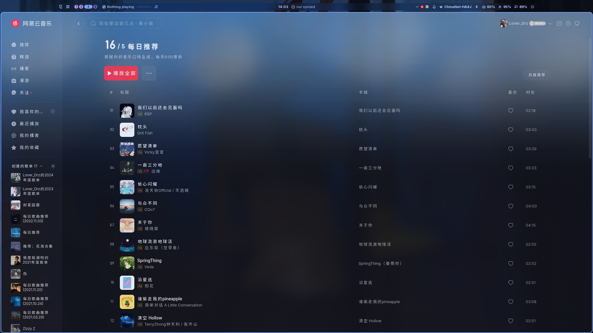

# ncm-desktop

> **Disclaimer**: This is an **unofficial** third-party desktop client. Not affiliated with NetEase, Inc. If you are a NetEase representative and find this project objectionable, please open an issue and it will be removed promptly.

An **unofficial** Linux desktop client for [NetEase Cloud Music](https://music.163.com), which works as a wrapper around the official web player.



## Installation

### NixOS / Nix

Run directly:

```bash
nix run github:lonerOrz/ncm-desktop
```

Or add as a flake input:

```nix
{
  inputs = {
    nixpkgs.url = "github:nixos/nixpkgs/nixos-unstable";
    flake-utils.url = "github:numtide/flake-utils";
    ncm-desktop.url = "github:lonerOrz/ncm-desktop";
  };

  outputs =
    inputs@{
      self,
      flake-utils,
      nixpkgs,
      ...
    }:
    flake-utils.lib.eachDefaultSystem (
      system:
      let
        pkgs = import nixpkgs {
          inherit system;
        };
      in
      {
        devShells.default = pkgs.mkShell {
          packages = [ inputs.ncm-desktop.packages.${system}.default ];
        };
      }
    );
}
```

Build locally:

```bash
nix build
# Binary at ./result/bin/ncm
```

### npm / electron-builder

Requirements: [Node.js](https://nodejs.org/).

```bash
npm install
npm run build      # Build package → dist/
npm start          # Or run directly without building
```

## Custom Styling & Scripting

You can inject custom CSS styles and JavaScript scripts to customize ncm-desktop's appearance and behavior.

### How it works

- **Custom Folder**: The custom files are stored in the following paths depending on your operating system:
  - **Linux**: `~/.config/ncm-desktop/custom/`
  - **macOS**: `~/Library/Application Support/ncm-desktop/custom/`
  - **Windows**: `%APPDATA%\ncm-desktop\custom\` (resolves to `C:\Users\<YourUsername>\AppData\Roaming\ncm-desktop\custom\`)
- **Easy Access**: Right-click the system tray icon and select **Open Custom Folder** to open the folder directly in your system file manager.
- **Alphabetical Order**: All `.css` and `.js` files in the folder are automatically loaded in alphabetical order.
- **CSS Hot Reloading**: Editing CSS files will automatically apply the new styles inside the running application instantly, without needing a restart.

### Example

1. Click **Open Custom Folder** from the tray menu.
2. Create a file named `01-custom.css` to change the background or tweak styling:
   ```css
   /* Change scrollbar style */
   ::-webkit-scrollbar {
     width: 6px !important;
   }
   ::-webkit-scrollbar-thumb {
     background-color: #e91e63 !important;
     border-radius: 3px !important;
   }
   ```
3. Create a file named `02-custom.js` to execute custom behavior:
   ```javascript
   console.log("Custom script loaded successfully!");
   ```
